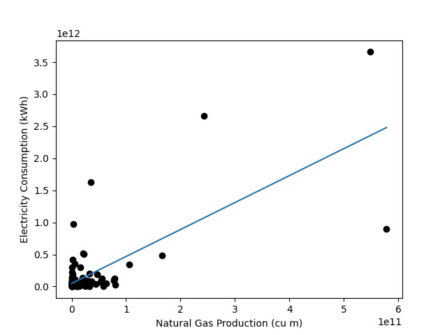
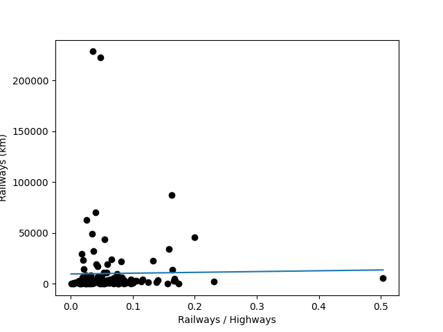

***Nathan Loria - CS 312 Final Project***
---
**Data**:
---
Source:
`https://perso.telecom-paristech.fr/eagan/class/igr204/datasets`

This data set is a collection of 44 health and economic indicators for 266 countries around the world. The data is sourced from the website of a professor in France and has been collected based on real world events and indicators.

**Motivation**:
---
All around the world, there are countries that are at extremely different developmental levels. Some are just now undergoing their technological revolution, some do not have enough money to ensure securities for their citizens, and some are developing high speed rail systems and rockets to send into space. The reason that this fact is important to me and relevant to the project is that when observing economic and public health data for different countries, certain trends become clear. When the right trends are discovered and a correlation can be observed between two different factors, and you can observe how these factors change from country to country, the ability to predict what may happen to a country in the future of it's development, and possibly help it's citizens, is a very powerful one. This project dives into different factors of a countries economy and public health in order to point out trends that would give somebody the knowledge to make a difference.

**Project Overview**:
---
The research questions that I used to guide my analysis of the data and test my hypotheses are as follows:
```
  1. Is there a correlation between GDP per capita and infant mortality rate?
  2. Is there a correlation between energy consumption and natural gas production in this data set?
  3. Do countries with more railways have less highways?
  4. Does a higher fertility rate correlate with a higher AIDS prevalence rate among adults? If so, how many countries are affected by this in the data set?
  5. Do the countries with the highest GDP have less debt (proportionally) than those with the lowest?
```

**Database System**:
---

**Justification**:

I chose MongoDB as the software for my project because the data set that I wanted to use was very large, hard to understand and develop schema for, and also contained some blank attributes which I feel Mongo handles better than SQL.

**Introduction**:

As previously stated, the database system that I chose to implement my final project is MongoDB. MongoDB is a free, open source NoSQL software that allows for the quick and easy retrieval of data. The reason that MongoDB is as efficient as it is, and is called a NoSQL (not only SQL) database is because it stores data in JSON format within objects called documents. A document in a Mongo database is similar to a row in an SQL table. These documents can then be queried using MongoDB's own query language, which has some similarities to typical SQL queries, in order to retrieve the desired data.

**Configuration**:

In order to set up the database for testing and querying, a MongoDB server had to be initialized on my machine. The following steps listed below were used to configure the MongoDB server and carry out this initialization.
```
  - mkdir -p ~/mongodata
  - sudo docker run -it -v ~/mongodata:/data/db --name mongodb -d mongo
  - sudo docker logs mongodb
  - sudo docker ps
  - sudo docker exec -it mongodb bash
```
Once these steps were completed, I was able to type `mongo` into the bash terminal and was ready to begin operations on the server.

**Data Insertion**:

Since the data that I downloaded was in CSV format, I decided that utilizing PyMongo to insert the data into the database would be the most efficient method. In order to do this, I created a file called `build.py`, located in the src directory. This file reads in the CSV data, and inserts each line as a document with it's respective fields and field names. Since the script requires a connection to the Mongo database located within the previously configured Docker container, it must be run from within the container. In order to test and execute the code, the file and the data must be transferred to the `~/mongodata/src/` directory using the `cp` command. Once the files are there, all that must be done is to install python3-pip, pymongo, matplotlib, and numpy. Now that all of the steps are in place, `build.py` can be executed using Python and insert the data into the `countries_db` database with a collection name of `country`. The figure listed below is a snippet of the code located in build.py:


**Database Structure**:

The code block below shows an example (Bahrain) of what the structure of each document looks like:
```
{
	"_id" : ObjectId("5fd399d8e082bd6e9d01a56e"),
	"Country" : "Bahrain",
	"Area" : 665,
	"Birth_rate" : 18.1,
	"Current_account_balance" : 586100000,
	"Death_rate" : 4.08,
	"Debt_external" : 6215000000,
	"Electricity_consumption" : 6379000000,
	"Electricity_production" : 6860000000,
	"Exports" : 8205000000,
	"GDP" : 13010000000,
	"GDP_per_capita" : 19200,
	"GDP_real_growth_rate" : 5.6,
	"HIV_AIDS_adult_prevalence_rate" : 0.2,
	"HIV_AIDS_deaths" : 200,
	"HIV_AIDS_people_living_with_HIV_AIDS" : 600,
	"Highways" : 3459,
	"Imports" : 5870000000,
	"Industrial_production_growth_rate" : 2,
	"Infant_mortality_rate" : 17.27,
	"Inflation_rate" : 2.1,
	"Internet_hosts" : 1334,
	"Internet_users" : 195700,
	"Investment" : 12.8,
	"Labor_force" : 370000,
	"Life_expectancy_at_birth" : 74.23,
	"Military_expenditures" : 628900000,
	"Military_expenditures_percent_of_GDP" : 6.3,
	"Natural_gas_consumption" : 32700000000,
	"Natural_gas_exports" : 0,
	"Natural_gas_imports" : 0,
	"Natural_gas_production" : 32700000000,
	"Natural_gas_proved_reserves" : 46000000000,
	"Oil_consumption" : 40000,
	"Oil_exports" : "",
	"Oil_imports" : "",
	"Oil_production" : 44000,
	"Oil_proved_reserves" : 126000000,
	"Population" : 688345,
	"Public_debt" : 63.8,
	"Railways" : "",
	"Reserves_of_foreign_exchange_and_gold" : 2141000000,
	"Telephones_main_lines_in_use" : 185800,
	"Telephones_mobile_cellular" : 443100,
	"Total_fertility_rate" : 2.63,
	"Unemployment_rate" : 15
}
```

**Research Questions**:
---
**Is there a correlation between GDP per capita and infant mortality rate?**

Query 1:
```
db.Country.aggregate([{ $group: { _id:null, avg_gdp_per_capita: {$avg:"$GDP_per_capita"} } }])
```

Description:
- Provide me with the average GDP_per_capita for each country in the database.

Results:
```
{ "_id" : null, "avg_gdp_per_capita" : 10552.760869565218 }
```
---
Query 2:
```
db.Country.aggregate([{ $match : { GDP_per_capita : { $lt: 10552 } } }, { $group: { _id:null, avg_infant_mortality_rate: {$avg:"$Infant_mortality_rate"} } }])
```

Description:
- Provide me with the average infant mortality rate in countries with a GDP_per_capita less than the average

Results:
```
{ "_id" : null, "avg_infant_mortality_rate" : 49.57312925170068 }
```
---
Query 3:
```
db.Country.aggregate([{ $match : { GDP_per_capita : { $gt: 10552 } } }, { $group: { _id:null, avg_infant_mortality_rate: {$avg:"$Infant_mortality_rate"} } }])
```

Description:
- Provide me with the average infant mortality rate in countries with a GDP_per_capita greater than the average.

Results:
```
{ "_id" : null, "avg_infant_mortality_rate" : 8.567179487179487 }
```

***Conclusion***:
To reiterate, the purpose of this research question was to determine if there was an observable link between GDP per capita and infant mortality rate in the countries within the data set. Based on the queries that were run, a clear correlation between GDP per capita and infant mortality rate can be observed. In countries where the GDP per capita is highest, there seems to be the lowest rates of infant mortality. This means that, unfortunately, in countries that boast "subpar" GDP per capita numbers, there are higher rates of infant mortality. According to the results of each query, the average GDP per capita for all of the countries on the list was 10,552. On average, the countries that are above this threshold have an infant mortality rate of `8.57 deaths / 1000 live births`. On the contrary, the countries below this mark have an average rate of `49.57 deaths / 1000 live births`. That is a difference of 41 deaths per 1000 babies born which is an alarming and upsetting fact.

---
**Is there a correlation between energy consumption and natural gas production in this data set?**

Query:
```
db.Country.find({ "Electricity_consumption" : { $ne : "" }, "Natural_gas_production" : { $ne : "" }},{ "Electricity_consumption":1, "Natural_gas_production":1 })
```

Description:
- Provide me with the electricity consumption and natural gas production of a country where both values are not equal to ""

Results:
<details><summary>Click for results</summary>
<p>
```
{ "Electricity_consumption" : 652200000, "Natural_gas_production" : 220000000 }
{ "Electricity_consumption" : 6760000000, "Natural_gas_production" : 30000000 }
{ "Electricity_consumption" : 23610000000, "Natural_gas_production" : 80300000000 }
{ "Electricity_consumption" : 1587000000, "Natural_gas_production" : 530000000 }
{ "Electricity_consumption" : 81650000000, "Natural_gas_production" : 37150000000 }
{ "Electricity_consumption" : 5797000000, "Natural_gas_production" : 0 }
{ "Electricity_consumption" : 195600000000, "Natural_gas_production" : 33080000000 }
{ "Electricity_consumption" : 55090000000, "Natural_gas_production" : 1731000000 }
{ "Electricity_consumption" : 17370000000, "Natural_gas_production" : 5720000000 }
{ "Electricity_consumption" : 6379000000, "Natural_gas_production" : 32700000000 }
{ "Electricity_consumption" : 15300000000, "Natural_gas_production" : 9900000000 }
{ "Electricity_consumption" : 744000000, "Natural_gas_production" : 29170000 }
{ "Electricity_consumption" : 34300000000, "Natural_gas_production" : 250000000 }
{ "Electricity_consumption" : 78820000000, "Natural_gas_production" : 0 }
{ "Electricity_consumption" : 3848000000, "Natural_gas_production" : 8440000000 }
{ "Electricity_consumption" : 8318000000, "Natural_gas_production" : 0 }
{ "Electricity_consumption" : 351900000000, "Natural_gas_production" : 5950000000 }
{ "Electricity_consumption" : 2286000000, "Natural_gas_production" : 10350000000 }
{ "Electricity_consumption" : 32710000000, "Natural_gas_production" : 4000000 }
{ "Electricity_consumption" : 3484000000, "Natural_gas_production" : 9980000000 }
{ "Electricity_consumption" : 3321000000, "Natural_gas_production" : 0 }
{ "Electricity_consumption" : 487300000000, "Natural_gas_production" : 165800000000 }
{ "Electricity_consumption" : 41800000000, "Natural_gas_production" : 1180000000 }
{ "Electricity_consumption" : 1630000000000, "Natural_gas_production" : 35000000000 }
{ "Electricity_consumption" : 41140000000, "Natural_gas_production" : 5700000000 }
{ "Electricity_consumption" : 573600000, "Natural_gas_production" : 0 }
{ "Electricity_consumption" : 2976000000, "Natural_gas_production" : 1350000000 }
{ "Electricity_consumption" : 15200000000, "Natural_gas_production" : 1760000000 }
{ "Electricity_consumption" : 13400000000, "Natural_gas_production" : 600000000 }
{ "Electricity_consumption" : 55330000000, "Natural_gas_production" : 160000000 }
{ "Electricity_consumption" : 31630000000, "Natural_gas_production" : 8380000000 }
{ "Electricity_consumption" : 75580000000, "Natural_gas_production" : 160000000 }
{ "Electricity_consumption" : 75580000000, "Natural_gas_production" : 21200000000 }
{ "Electricity_consumption" : 24820000, "Natural_gas_production" : 20000000 }
{ "Electricity_consumption" : 6358000000, "Natural_gas_production" : 0 }
{ "Electricity_consumption" : 2661000000000, "Natural_gas_production" : 242600000000 }
{ "Electricity_consumption" : 78580000000, "Natural_gas_production" : 0 }
{ "Electricity_consumption" : 414700000000, "Natural_gas_production" : 1898000000 }
{ "Electricity_consumption" : 1080000000, "Natural_gas_production" : 80000000 }
{ "Electricity_consumption" : 6811000000, "Natural_gas_production" : 60000000 }
{ "Electricity_consumption" : 519500000000, "Natural_gas_production" : 21000000000 }
{ "Electricity_consumption" : 47420000000, "Natural_gas_production" : 35000000 }
{ "Electricity_consumption" : 35990000000, "Natural_gas_production" : 3231000000 }
{ "Electricity_consumption" : 510100000000, "Natural_gas_production" : 22750000000 }
{ "Electricity_consumption" : 92350000000, "Natural_gas_production" : 77600000000 }
{ "Electricity_consumption" : 119900000000, "Natural_gas_production" : 79000000000 }
{ "Electricity_consumption" : 33700000000, "Natural_gas_production" : 2350000000 }
{ "Electricity_consumption" : 21780000000, "Natural_gas_production" : 815000000 }
{ "Electricity_consumption" : 38300000000, "Natural_gas_production" : 10000000 }
{ "Electricity_consumption" : 293900000000, "Natural_gas_production" : 15490000000 }
{ "Electricity_consumption" : 971000000000, "Natural_gas_production" : 2519000000 }
{ "Electricity_consumption" : 7094000000, "Natural_gas_production" : 290000000 }
{ "Electricity_consumption" : 62210000000, "Natural_gas_production" : 11600000000 }
{ "Electricity_consumption" : 293600000000, "Natural_gas_production" : 0 }
{ "Electricity_consumption" : 30160000000, "Natural_gas_production" : 8700000000 }
{ "Electricity_consumption" : 10210000000, "Natural_gas_production" : 16000000 }
{ "Electricity_consumption" : 5829000000, "Natural_gas_production" : 0 }
{ "Electricity_consumption" : 19430000000, "Natural_gas_production" : 6180000000 }
{ "Electricity_consumption" : 10170000000, "Natural_gas_production" : 0 }
{ "Electricity_consumption" : 5735000000, "Natural_gas_production" : 0 }
{ "Electricity_consumption" : 68400000000, "Natural_gas_production" : 53660000000 }
{ "Electricity_consumption" : 189700000000, "Natural_gas_production" : 47300000000 }
{ "Electricity_consumption" : 4605000000, "Natural_gas_production" : 0 }
{ "Electricity_consumption" : 14240000000, "Natural_gas_production" : 50000000 }
{ "Electricity_consumption" : 5046000000, "Natural_gas_production" : 60000000 }
{ "Electricity_consumption" : 100700000000, "Natural_gas_production" : 77750000000 }
{ "Electricity_consumption" : 35710000000, "Natural_gas_production" : 6504000000 }
{ "Electricity_consumption" : 18430000000, "Natural_gas_production" : 15680000000 }
{ "Electricity_consumption" : 107400000000, "Natural_gas_production" : 54600000000 }
{ "Electricity_consumption" : 9792000000, "Natural_gas_production" : 13770000000 }
{ "Electricity_consumption" : 52660000000, "Natural_gas_production" : 23400000000 }
{ "Electricity_consumption" : 1561000000, "Natural_gas_production" : 110000000 }
{ "Electricity_consumption" : 20220000000, "Natural_gas_production" : 910000000 }
{ "Electricity_consumption" : 46050000000, "Natural_gas_production" : 2500000 }
{ "Electricity_consumption" : 117400000000, "Natural_gas_production" : 5471000000 }
{ "Electricity_consumption" : 42150000000, "Natural_gas_production" : 0 }
{ "Electricity_consumption" : 20540000000, "Natural_gas_production" : 0 }
{ "Electricity_consumption" : 9046000000, "Natural_gas_production" : 32400000000 }
{ "Electricity_consumption" : 57500000000, "Natural_gas_production" : 12600000000 }
{ "Electricity_consumption" : 894300000000, "Natural_gas_production" : 578600000000 }
{ "Electricity_consumption" : 128500000000, "Natural_gas_production" : 56400000000 }
{ "Electricity_consumption" : 1615000000, "Natural_gas_production" : 50000000 }
{ "Electricity_consumption" : 32330000000, "Natural_gas_production" : 602000000 }
{ "Electricity_consumption" : 32000000000, "Natural_gas_production" : 0 }
{ "Electricity_consumption" : 28890000000, "Natural_gas_production" : 190000000 }
{ "Electricity_consumption" : 11800000000, "Natural_gas_production" : 0 }
{ "Electricity_consumption" : 189400000000, "Natural_gas_production" : 1800000000 }
{ "Electricity_consumption" : 218400000000, "Natural_gas_production" : 516000000 }
{ "Electricity_consumption" : 138100000000, "Natural_gas_production" : 0 }
{ "Electricity_consumption" : 54530000000, "Natural_gas_production" : 0 }
{ "Electricity_consumption" : 24320000000, "Natural_gas_production" : 5840000000 }
{ "Electricity_consumption" : 147400000000, "Natural_gas_production" : 750000000 }
{ "Electricity_consumption" : 14410000000, "Natural_gas_production" : 50000000 }
{ "Electricity_consumption" : 106100000000, "Natural_gas_production" : 18730000000 }
{ "Electricity_consumption" : 5341000000, "Natural_gas_production" : 25000000000 }
{ "Electricity_consumption" : 10050000000, "Natural_gas_production" : 2250000000 }
{ "Electricity_consumption" : 117900000000, "Natural_gas_production" : 312000000 }
{ "Electricity_consumption" : 8908000000, "Natural_gas_production" : 58570000000 }
{ "Electricity_consumption" : 132000000000, "Natural_gas_production" : 19600000000 }
{ "Electricity_consumption" : 36510000000, "Natural_gas_production" : 44400000000 }
{ "Electricity_consumption" : 337400000000, "Natural_gas_production" : 105900000000 }
{ "Electricity_consumption" : 3660000000000, "Natural_gas_production" : 548100000000 }
{ "Electricity_consumption" : 5878000000, "Natural_gas_production" : 0 }
{ "Electricity_consumption" : 46660000000, "Natural_gas_production" : 63100000000 }
{ "Electricity_consumption" : 89300000000, "Natural_gas_production" : 29400000000 }
{ "Electricity_consumption" : 32060000000, "Natural_gas_production" : 1300000000 }
{ "Electricity_consumption" : 2827000000, "Natural_gas_production" : 0 }
```
</p>
</details>
<br></br>

Plot:



---
**Do countries with more railways have less highways?**

Query:
```
{ "Railways" : { $ne : "" }, "Highways" : { $ne : "" } },{ "_id" : 0, "Railways" : 1, "Highways" : 1 }
```

Description:
- Provide me with the length of railways and highways in a country where both values are not equal to "".

Results:
<details><summary>Click for results</summary>
<p>
```
{ "Highways" : 18000, "Railways" : 447 }
{ "Highways" : 104000, "Railways" : 3973 }
{ "Highways" : 51429, "Railways" : 2761 }
{ "Highways" : 215471, "Railways" : 34091 }
{ "Highways" : 8431, "Railways" : 845 }
{ "Highways" : 811603, "Railways" : 43802 }
{ "Highways" : 200000, "Railways" : 6021 }
{ "Highways" : 28030, "Railways" : 2957 }
{ "Highways" : 207486, "Railways" : 2706 }
{ "Highways" : 79990, "Railways" : 5523 }
{ "Highways" : 149028, "Railways" : 3518 }
{ "Highways" : 6787, "Railways" : 578 }
{ "Highways" : 60282, "Railways" : 3519 }
{ "Highways" : 21846, "Railways" : 1021 }
{ "Highways" : 10217, "Railways" : 888 }
{ "Highways" : 1724929, "Railways" : 29412 }
{ "Highways" : 37077, "Railways" : 4294 }
{ "Highways" : 12506, "Railways" : 622 }
{ "Highways" : 28200, "Railways" : 3955 }
{ "Highways" : 12323, "Railways" : 602 }
{ "Highways" : 34300, "Railways" : 1008 }
{ "Highways" : 1408800, "Railways" : 48909 }
{ "Highways" : 79605, "Railways" : 6585 }
{ "Highways" : 1765222, "Railways" : 70058 }
{ "Highways" : 112998, "Railways" : 3304 }
{ "Highways" : 157000, "Railways" : 5138 }
{ "Highways" : 12800, "Railways" : 894 }
{ "Highways" : 35303, "Railways" : 950 }
{ "Highways" : 50400, "Railways" : 660 }
{ "Highways" : 28344, "Railways" : 2726 }
{ "Highways" : 60858, "Railways" : 4226 }
{ "Highways" : 127204, "Railways" : 9520 }
{ "Highways" : 71847, "Railways" : 3002 }
{ "Highways" : 2890, "Railways" : 100 }
{ "Highways" : 12600, "Railways" : 1743 }
{ "Highways" : 43197, "Railways" : 966 }
{ "Highways" : 64000, "Railways" : 5063 }
{ "Highways" : 10029, "Railways" : 283 }
{ "Highways" : 4010, "Railways" : 306 }
{ "Highways" : 55944, "Railways" : 958 }
{ "Highways" : 33297, "Railways" : 681 }
{ "Highways" : 4634810, "Railways" : 222293 }
{ "Highways" : 3440, "Railways" : 597 }
{ "Highways" : 78197, "Railways" : 5851 }
{ "Highways" : 893100, "Railways" : 32175 }
{ "Highways" : 8464, "Railways" : 814 }
{ "Highways" : 20229, "Railways" : 1612 }
{ "Highways" : 230735, "Railways" : 46039 }
{ "Highways" : 46176, "Railways" : 953 }
{ "Highways" : 117000, "Railways" : 2571 }
{ "Highways" : 14118, "Railways" : 886 }
{ "Highways" : 30500, "Railways" : 837 }
{ "Highways" : 7970, "Railways" : 187 }
{ "Highways" : 13603, "Railways" : 699 }
{ "Highways" : 159568, "Railways" : 7937 }
{ "Highways" : 2525989, "Railways" : 63140 }
{ "Highways" : 342700, "Railways" : 6458 }
{ "Highways" : 167157, "Railways" : 7203 }
{ "Highways" : 45550, "Railways" : 1963 }
{ "Highways" : 95736, "Railways" : 3312 }
{ "Highways" : 16903, "Railways" : 640 }
{ "Highways" : 479688, "Railways" : 19507 }
{ "Highways" : 18700, "Railways" : 272 }
{ "Highways" : 1171647, "Railways" : 23705 }
{ "Highways" : 7301, "Railways" : 505 }
{ "Highways" : 82980, "Railways" : 13601 }
{ "Highways" : 63942, "Railways" : 2778 }
{ "Highways" : 31200, "Railways" : 5214 }
{ "Highways" : 86990, "Railways" : 3125 }
{ "Highways" : 18500, "Railways" : 470 }
{ "Highways" : 60472, "Railways" : 2303 }
{ "Highways" : 7300, "Railways" : 401 }
{ "Highways" : 10600, "Railways" : 490 }
{ "Highways" : 77148, "Railways" : 1998 }
{ "Highways" : 5210, "Railways" : 274 }
{ "Highways" : 8684, "Railways" : 699 }
{ "Highways" : 49827, "Railways" : 732 }
{ "Highways" : 28400, "Railways" : 797 }
{ "Highways" : 65877, "Railways" : 2418 }
{ "Highways" : 15100, "Railways" : 729 }
{ "Highways" : 800, "Railways" : 61 }
{ "Highways" : 329532, "Railways" : 19510 }
{ "Highways" : 12719, "Railways" : 1138 }
{ "Highways" : 57694, "Railways" : 1907 }
{ "Highways" : 30400, "Railways" : 3123 }
{ "Highways" : 42237, "Railways" : 2382 }
{ "Highways" : 13223, "Railways" : 59 }
{ "Highways" : 116500, "Railways" : 2808 }
{ "Highways" : 92382, "Railways" : 3898 }
{ "Highways" : 18712, "Railways" : 6 }
{ "Highways" : 194394, "Railways" : 3557 }
{ "Highways" : 91852, "Railways" : 4077 }
{ "Highways" : 257683, "Railways" : 8163 }
{ "Highways" : 11643, "Railways" : 355 }
{ "Highways" : 29500, "Railways" : 441 }
{ "Highways" : 78230, "Railways" : 3462 }
{ "Highways" : 202124, "Railways" : 897 }
{ "Highways" : 364697, "Railways" : 23852 }
{ "Highways" : 17135, "Railways" : 2850 }
{ "Highways" : 25328, "Railways" : 96 }
{ "Highways" : 198755, "Railways" : 11385 }
{ "Highways" : 537289, "Railways" : 87157 }
{ "Highways" : 320, "Railways" : 50 }
{ "Highways" : 152044, "Railways" : 1392 }
{ "Highways" : 14576, "Railways" : 906 }
{ "Highways" : 45290, "Railways" : 4380 }
{ "Highways" : 42970, "Railways" : 3661 }
{ "Highways" : 20250, "Railways" : 1201 }
{ "Highways" : 275971, "Railways" : 22298 }
{ "Highways" : 664852, "Railways" : 14268 }
{ "Highways" : 11650, "Railways" : 1449 }
{ "Highways" : 11900, "Railways" : 5995 }
{ "Highways" : 3107, "Railways" : 301 }
{ "Highways" : 213237, "Railways" : 11481 }
{ "Highways" : 71212, "Railways" : 4533 }
{ "Highways" : 45697, "Railways" : 2711 }
{ "Highways" : 37299, "Railways" : 2508 }
{ "Highways" : 27767, "Railways" : 482 }
{ "Highways" : 88200, "Railways" : 3690 }
{ "Highways" : 57403, "Railways" : 4071 }
{ "Highways" : 7520, "Railways" : 568 }
{ "Highways" : 18997, "Railways" : 2152 }
{ "Highways" : 354421, "Railways" : 8671 }
{ "Highways" : 24000, "Railways" : 2440 }
{ "Highways" : 27000, "Railways" : 1241 }
{ "Highways" : 169679, "Railways" : 22473 }
{ "Highways" : 392931, "Railways" : 17186 }
{ "Highways" : 6393603, "Railways" : 228464 }
{ "Highways" : 8983, "Railways" : 2073 }
{ "Highways" : 81600, "Railways" : 3950 }
{ "Highways" : 96155, "Railways" : 682 }
{ "Highways" : 93300, "Railways" : 2600 }
{ "Highways" : 91440, "Railways" : 2173 }
{ "Highways" : 18338, "Railways" : 3077 }
```
</p>
</details>
<br></br>

Plot:



**Does a higher fertility rate correlate with a higher AIDS prevalence rate among adults? If so, how many countries are affected by this in the data set?**

Query 1:
```
db.Country.aggregate([{ $group: { _id:null, avg_fertility_rate: {$avg:"$Total_fertility_rate"} } }])
```

Description:
- Show me the average fertility rate for all countries in the data set.

Results:
```
{ "_id" : null, "avg_fertility_rate" : 2.937777777777778 }
```
---
Query 2:
```
db.Country.aggregate([{ $match : { Total_fertility_rate : { $gt: 2.9 } } }, { $group: { _id:null, avg_aids_prev_rate: {$avg:"$HIV_AIDS_adult_prevalence_rate"}, count: { $sum: 1 } } }])
```

Description:
- Give me the average AIDS prevalence rate in countries who's fertility rate is higher than the average, and the number of countries that this effects.

Results:
```
{ "_id" : null, "avg_aids_prev_rate" : 4.552499999999999, "count" : 88 }
```
---
Query 3:
```
db.Country.aggregate([{ $match : { Total_fertility_rate : { $lt: 2.9 } } }, { $group: { _id:null, avg_aids_prev_rate: {$avg:"$HIV_AIDS_adult_prevalence_rate"} } }])
```

Description:
- Give me the average AIDS prevalence rate in countries who's fertility rate is lower than the average.

Results:
```
{ "_id" : null, "avg_aids_prev_rate" : 1.0409473684210526 }
```

**Do the countries with the highest GDP have less debt (proportionally) than those with the lowest?**

Query 1:
```
db.Country.find({ "GDP" : { $ne : "" }, "Debt_external" : { $ne : "" } },{ "_id" : 0, "Country" : 1, "GDP" : 1, "Debt_external" : 1 }).sort({ "GDP" : -1 }).limit(10)
```

Description:
- Provide me with a list of the top 10 countries by GDP where both GDP and external debt are available.

Results:
```
{ "Country" : "United States", "Debt_external" : 1400000000000, "GDP" : 11750000000000 }
{ "Country" : "China", "Debt_external" : 233300000000, "GDP" : 7262000000000 }
{ "Country" : "India", "Debt_external" : 117200000000, "GDP" : 3319000000000 }
{ "Country" : "United Kingdom", "Debt_external" : 4710000000000, "GDP" : 1782000000000 }
{ "Country" : "Italy", "Debt_external" : 913900000000, "GDP" : 1609000000000 }
{ "Country" : "Brazil", "Debt_external" : 219800000000, "GDP" : 1492000000000 }
{ "Country" : "Russia", "Debt_external" : 169600000000, "GDP" : 1408000000000 }
{ "Country" : "Canada", "Debt_external" : 570000000000, "GDP" : 1023000000000 }
{ "Country" : "Mexico", "Debt_external" : 149900000000, "GDP" : 1006000000000 }
{ "Country" : "Spain", "Debt_external" : 771100000000, "GDP" : 937600000000 }
```
---
Query 2:
```
db.Country.find({ "GDP" : { $ne : "" }, "Debt_external" : { $ne : "" } },{ "_id" : 0, "Country" : 1, "GDP" : 1, "Debt_external" : 1 }).sort({ "GDP" : 1 }).limit(10)
```

Description:
- Provide me with a list of the bottom 10 countries by GDP where both GDP and external debt are available.

Results:
```
{ "Country" : "Tokelau", "Debt_external" : 0, "GDP" : 1500000 }
{ "Country" : "Niue", "Debt_external" : 418000, "GDP" : 7600000 }
{ "Country" : "Montserrat", "Debt_external" : 8900000, "GDP" : 29000000 }
{ "Country" : "Nauru", "Debt_external" : 33300000, "GDP" : 60000000 }
{ "Country" : "Kiribati", "Debt_external" : 10000000, "GDP" : 79000000 }
{ "Country" : "Cook Islands", "Debt_external" : 141000000, "GDP" : 105000000 }
{ "Country" : "Anguilla", "Debt_external" : 8800000, "GDP" : 112000000 }
{ "Country" : "Marshall Islands", "Debt_external" : 86500000, "GDP" : 115000000 }
{ "Country" : "Palau", "Debt_external" : 0, "GDP" : 174000000 }
{ "Country" : "Sao Tome and Principe", "Debt_external" : 318000000, "GDP" : 214000000 }
```
